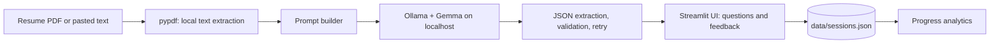

# 🎯 PlacePal

**An offline mock-interview partner for campus placements, powered by an open-weight model running on your own laptop.**

PlacePal reads your resume, asks questions tailored to *your* projects and your target role, scores each answer honestly, and tracks which topics keep dragging your scores down. Everything runs locally through [Ollama](https://ollama.com) with a [Gemma](https://ai.google.dev/gemma) model. There is no API key, no account, no cloud, and no bill.

> Built for the **DEV Hacktoberfest Weekend Challenge: Build for a Friend** (Oct 2-5, 2026), for a friend preparing for campus placements.

## Why local matters here

A resume carries your phone number, email, college and projects. Interview answers carry your weaknesses. That is exactly the data you do not want to paste into a hosted chatbot.

| | PlacePal (local open-weight model) | Typical hosted chatbot |
|---|---|---|
| Resume leaves your machine | **No** | Yes |
| Works with Wi-Fi off | **Yes** | No |
| Cost per practice session | **Zero** | Credits / subscription |
| Swap the model | **One env var** | Locked to the vendor |
| Inspect what the model sees | **Yes** (all prompts are in [`placepal/prompts.py`](placepal/prompts.py)) | No |

The app also checks `OLLAMA_HOST` and shows a warning banner if your Ollama server is not on this machine, so the privacy claim stays honest.

## Features

- **Resume-aware questions**: 5 questions per round (2 technical, 2 project, 1 HR), tailored to your resume and role.
- **Five target roles**: SDE, Data Analyst, ML / Data Science Engineer, Cybersecurity Analyst, Frontend / Full-Stack.
- **Three difficulty levels**: Easy, Medium, Hard.
- **Honest scoring**: each answer gets a 1-10 score, strengths, gaps and a stronger sample answer. Tiny answers are score-capped in code, so a one-word reply can never score well whatever the model says.
- **Progress tab**: average score per topic, weakest topics to revise, and session history.
- **Private by design**: sessions are saved to `data/sessions.json` on your machine, which is git-ignored. One click deletes everything.
- **Robust to small-model quirks**: JSON replies are extracted from markdown fences or chatter, validated, and retried when malformed.

## Quick start

**1. Install Ollama and pull a model**

Download Ollama from <https://ollama.com/download>, then:

```bash
ollama pull gemma3:4b      # ~3.3 GB. Use gemma3:1b on low-RAM machines
```

**2. Install and run PlacePal**

```bash
git clone https://github.com/Aakif-Kohari/placepal.git
cd placepal
python -m venv .venv
source .venv/bin/activate          # Windows: .venv\Scripts\activate
pip install -r requirements.txt
streamlit run app.py
```

**3. Practice**

Upload your resume PDF (or paste its text), choose a role and difficulty, press **Start interview**, answer, and press **Evaluate** on each question.

## Configuration

| Variable | Default | Purpose |
|---|---|---|
| `PLACEPAL_MODEL` | `gemma3:4b` | Any model available in your local Ollama, e.g. `gemma3:1b`, `qwen3:4b` |
| `OLLAMA_HOST` | `http://127.0.0.1:11434` | Where Ollama is running |
| `PLACEPAL_DATA` | `data/sessions.json` | Where practice sessions are stored |

Example, trying a different open-weight model without touching any code:

```bash
PLACEPAL_MODEL=qwen3:4b streamlit run app.py
```

## How it works



| Module | Responsibility |
|---|---|
| [`app.py`](app.py) | Streamlit interface (Interview and Progress tabs) |
| [`placepal/llm.py`](placepal/llm.py) | Ollama wrapper, JSON extraction, retries, local-host check |
| [`placepal/prompts.py`](placepal/prompts.py) | All prompts, roles and difficulty notes |
| [`placepal/schema.py`](placepal/schema.py) | Validation of model output |
| [`placepal/interview.py`](placepal/interview.py) | Question generation and answer evaluation |
| [`placepal/resume.py`](placepal/resume.py) | PDF text extraction and cleanup |
| [`placepal/storage.py`](placepal/storage.py) | Atomic local JSON storage |
| [`placepal/analytics.py`](placepal/analytics.py) | Topic averages and weakest topics |

More detail in [`docs/ARCHITECTURE.md`](docs/ARCHITECTURE.md).

## Testing

```bash
pip install -r requirements-dev.txt
pytest -q
```

The suite (34 tests) covers JSON extraction and retries, output validation, score capping, storage, analytics, and the full Streamlit flow using Streamlit's `AppTest`. The tests replace the model call with a fake, so they run anywhere without Ollama. GitHub Actions runs them on every push.

## Known limitations

- Small local models can be generous or inconsistent graders. Treat scores as practice feedback, not a verdict. Larger models (`gemma3:12b` or up) grade more strictly if your hardware allows.
- Scanned (image-only) resumes have no extractable text. Paste the text instead.
- Question quality depends on how much detail your resume contains.
- Answers are typed. Voice input is on the roadmap.

## Roadmap

- Voice answers through local speech-to-text
- Hindi / Marathi explanations for improved answers
- Company-specific question banks
- Export a revision plan as PDF

## Privacy

- Resume text and answers are sent only to the Ollama server you configure (localhost by default).
- Streamlit's anonymous usage statistics are disabled in [`.streamlit/config.toml`](.streamlit/config.toml).
- `data/` is git-ignored so practice history is never committed by accident.

## Acknowledgements

Built with [Ollama](https://ollama.com), [Gemma](https://ai.google.dev/gemma) by Google, [Streamlit](https://streamlit.io) and [pypdf](https://github.com/py-pdf/pypdf). Parts of the code were written with the help of an AI assistant and reviewed and tested by the author.

## License

[MIT](LICENSE)
